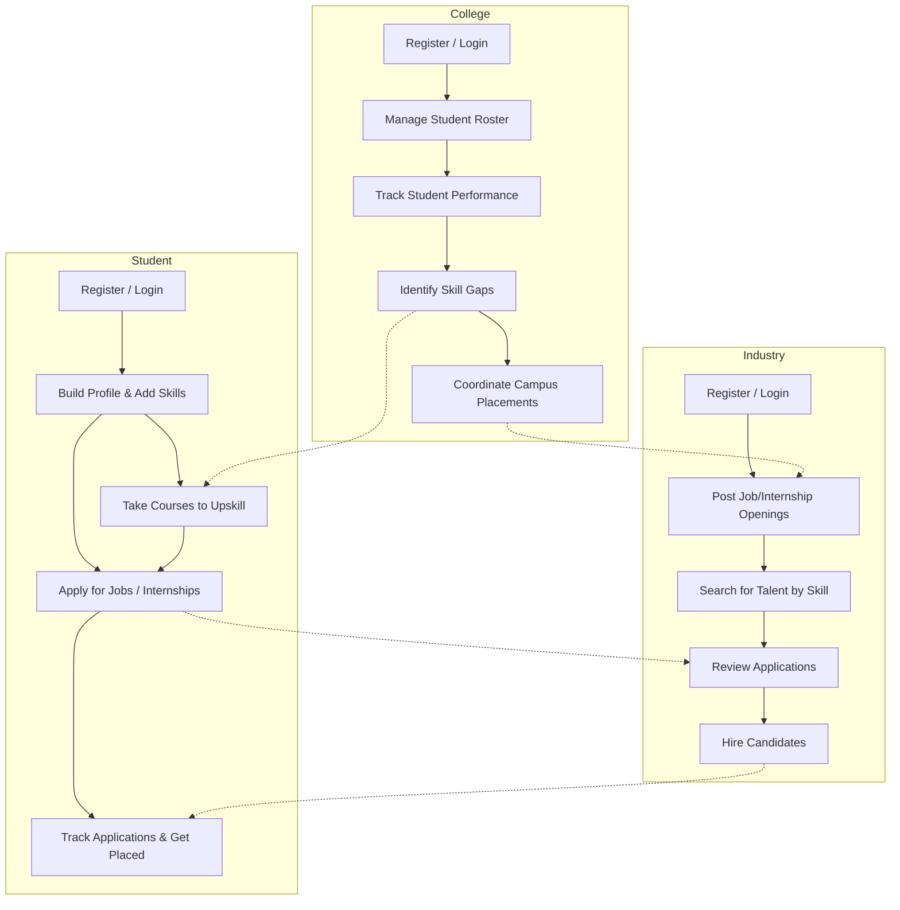

# SkillBridge 🌉

SkillBridge is a comprehensive platform designed to bridge the gap between Students, Colleges, and the Industry. It facilitates skill development, job/internship placements, and talent discovery, developed as part of **Smart India Hackathon (SIH 26044)**.

## 🚀 Features

The platform provides a robust, role-based architecture to cater to the distinct needs of its users:

### 🎓 Students
- Manage personal profiles and showcase skills.
- Enroll in courses to bridge skill gaps.
- Apply for jobs and internships.
- Track applications and receive real-time notifications.

### 🏫 Colleges
- Manage curriculum and track student performance.
- Identify skill gaps within the student body.
- Connect with companies and manage placement opportunities.
- Oversee student profiles and track their placement progress.

### 🏢 Industry
- Post jobs and internship opportunities.
- Discover and recruit top talent based on skills.
- Offer courses and training programs.
- Connect with colleges for campus placements.

### 🛡️ Admin
- Comprehensive dashboard to manage the entire platform.
- Manage courses, certifications, and skills.
- Oversee user accounts (Students, Colleges, Industry).
- Monitor system-wide analytics.

## 🔄 User Workflows

The platform operates through interconnected workflows among its three primary user types: Students, Colleges, and Industry.



## 💻 Tech Stack

**Frontend:**
- React (with Vite)
- React Router DOM for navigation
- Firebase for authentication and storage
- Recharts for analytics and data visualization

**Backend:**
- Node.js & Express.js
- MySQL (with `mysql2` driver)
- JWT (JSON Web Tokens) for secure API authentication
- BcryptJS for password hashing
- Multer for handling file uploads

## 🛠️ Getting Started

Follow these instructions to set up the project locally.

### Prerequisites
- [Node.js](https://nodejs.org/) (v18 or higher recommended)
- [MySQL](https://www.mysql.com/) Server
- A [Firebase](https://firebase.google.com/) Project for authentication

### Installation

1. **Clone the repository** (if applicable) or navigate to the project directory:
   ```bash
   cd "SIH 26"
   ```

2. **Setup Backend:**
   Navigate to the backend directory and install dependencies:
   ```bash
   cd backend
   npm install
   ```

3. **Setup Frontend:**
   Navigate to the frontend directory and install dependencies:
   ```bash
   cd ../frontend
   npm install
   ```

### Environment Variables

You will need to set up environment variables for both the backend and frontend.

**Backend (`backend/.env`):**
Create a `.env` file in the `backend` directory using `backend/.env.example` as a template:
```env
NODE_ENV=development
PORT=5000

# MySQL Database
DB_HOST=localhost
DB_PORT=3306
DB_USER=root
DB_PASSWORD=your_database_password
DB_NAME=skillbridge

# JWT
JWT_SECRET=your_jwt_secret_key
JWT_EXPIRES_IN=7d

# File Upload
MAX_FILE_SIZE=5242880
UPLOAD_PATH=./uploads

# CORS
FRONTEND_URL=http://localhost:5173
```

**Frontend (`frontend/.env`):**
Create a `.env` file in the `frontend` directory using `frontend/.env.example` as a template:
```env
VITE_FIREBASE_API_KEY="your_api_key"
VITE_FIREBASE_AUTH_DOMAIN="your_project_id.firebaseapp.com"
VITE_FIREBASE_PROJECT_ID="your_project_id"
VITE_FIREBASE_STORAGE_BUCKET="your_project_id.firebasestorage.app"
VITE_FIREBASE_MESSAGING_SENDER_ID="your_messaging_sender_id"
VITE_FIREBASE_APP_ID="your_app_id"
```

### Running the Application

1. **Start the Backend Server:**
   ```bash
   cd backend
   npm run dev
   ```
   *The backend server will run on `http://localhost:5000` (or the port specified in your `.env`).*

2. **Start the Frontend Server:**
   Open a new terminal window/tab:
   ```bash
   cd frontend
   npm run dev
   ```
   *The frontend application will be accessible at `http://localhost:5173`.*

## 🗄️ Database Setup

The backend `package.json` provides scripts to manage your database schema and seed data.
Ensure your MySQL server is running and the database specified in your `.env` is created.

Run the following commands in the `backend` directory:

- Run migrations: `npm run migrate`
- Seed initial data: `npm run seed`

---
*Built for SIH 26044.*
